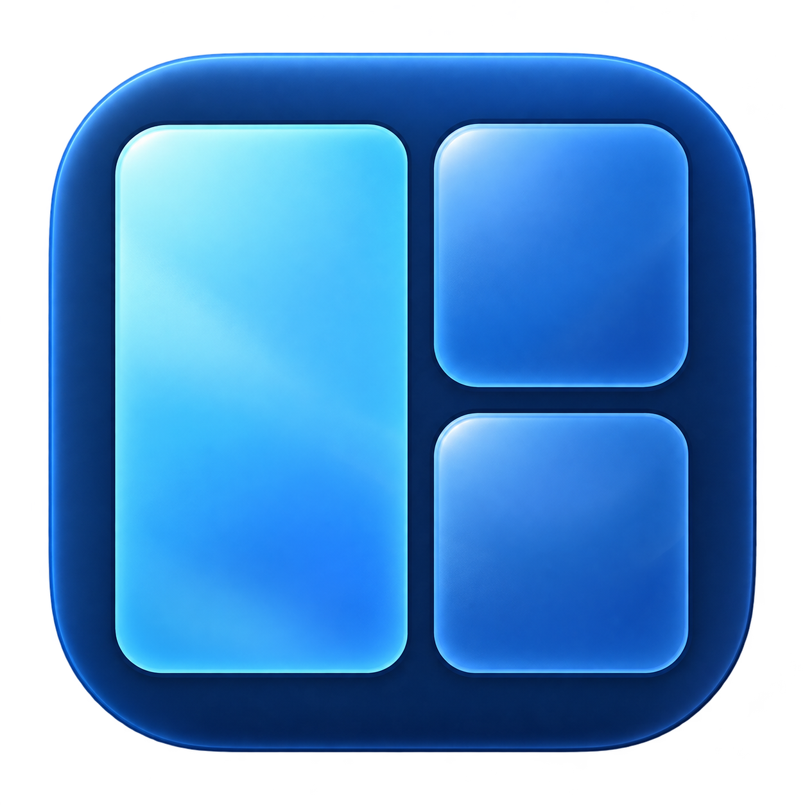

# Not Fancy Zones

A lightweight native macOS menu bar app for arranging windows into per-monitor zones. Inspired by PowerToys FancyZones. Built with Swift, AppKit, and a SwiftUI settings editor, with no third-party dependencies.



Requires macOS 14 or newer. **Xcode Command Line Tools are enough**: they include the Swift compiler and macOS SDK. The package requires Swift tools version 6.0 and has been validated with Swift 6.3.3. Full Xcode and Homebrew are not needed.

## Build and run

```sh
./scripts/build.sh
open "dist/Not Fancy Zones.app" --args --settings
```

For a stable everyday location, quit the app and install it:

```sh
./scripts/install.sh
```

This installs to `~/Applications/Not Fancy Zones.app`. The app uses the same blue icon in the menu bar and settings sidebar, and has no Dock icon. Use its menu to open Settings, preview zones, restore windows, pause, or quit. Enable **Launch at login** in Settings if desired. If macOS requires approval, finish enabling it in System Settings → General → Login Items & Extensions.

If Launch at login reports **Invalid argument (22)**, quit and reopen the `.app` through Finder or the `open` command above. Launching `Contents/MacOS/NotFancyZones` directly from a terminal/test harness can cause this error. Use the installed copy for everyday use.

Allow **Not Fancy Zones** in **System Settings → Privacy & Security → Accessibility**, then click **Check again** in the app (or reopen its menu). macOS requires this permission for moving/resizing other applications and observing Shift-drag events. The app does not request Screen Recording or Automation permission. It cannot grant its own permission.

**Check again** reports the current result and check time. If the macOS switch is already on but access is still denied, use **Restart app**. If that does not help, remove the stale Accessibility entry and add the exact bundle shown in Settings; **Show this app in Finder** locates it. A checked entry for an older build or another copy may not authorize the running app.

Builds are ad-hoc signed by default, so updates may invalidate Accessibility authorization. To preserve identity across future versions, install your Developer ID Application certificate and private key, then configure it once:

```sh
./scripts/configure-signing.sh "Developer ID Application: Your Name (TEAMID)"
./scripts/install.sh
```

This saves the certificate name in a gitignored `.signing-identity` file; it does not create certificates or modify Keychain. Build, install, and release scripts use it automatically. A missing configured identity fails the build instead of silently switching back to ad-hoc signing. `SIGNING_IDENTITY` can override it for a single invocation.

Switching from ad-hoc signing to Developer ID may require one more authorization. Keep the bundle identifier (`app.notfancyzones`), signing team, and installation location consistent afterward. macOS recognizes updates through their [code signing requirement](https://developer.apple.com/documentation/technotes/tn3127-inside-code-signing-requirements); certificate signing supports persistent identity, though macOS still controls permission. Public distribution also benefits from notarization. No certificate is required for local development.

Builds assemble and verify a new bundle before replacing the previous output. Restart a running app after rebuilding; installing refuses to proceed while an instance is running.

## Package for GitHub Releases

Upload a **ZIP containing the `.app`**, since the `.app` is a directory bundle. Generate the release assets with:

```sh
./scripts/release.sh
# Or set the packaged version and build number:
APP_BUILD=2 ./scripts/release.sh 0.2.0
```

The script always builds the optimized release configuration, includes the app icon, and produces:

```text
dist/Not-Fancy-Zones-0.1.0-macos-arm64.zip
dist/Not-Fancy-Zones-0.1.0-macos-arm64.zip.sha256
```

The filename uses the bundle version and actual executable architecture. On an Apple Silicon Mac, the normal build is `arm64`, not a universal Intel/Apple Silicon binary. The optional version/build overrides affect the built bundle only; edit `Resources/Info.plist` to change the persistent project defaults.

The ZIP is created with Apple's `ditto`, then extracted and checked for executable permissions, its code signature, icon, and bundled MIT license. Source files, test fixtures, and local settings are not included. Existing assets for the same version/architecture are replaced. No upload occurs.

Attach the ZIP and optional SHA-256 file to a [GitHub Release](https://docs.github.com/en/repositories/releasing-projects-on-github/managing-releases-in-a-repository). Users unzip it and drag **Not Fancy Zones.app** into Applications. To verify a downloaded ZIP, run `shasum -a 256 -c <archive>.zip.sha256` from the directory containing both files.

The default archive is ad-hoc signed and **not notarized**, so downloaded copies may be blocked by Gatekeeper. For normal public distribution, use your Developer ID Application certificate and Apple's notarization workflow. The build supports signing with hardened runtime and a secure timestamp:

```sh
./scripts/configure-signing.sh "Developer ID Application: Your Name (TEAMID)"
./scripts/release.sh
```

This signs the app but does not submit it to Apple. See [Apple's distribution packaging guide](https://developer.apple.com/documentation/xcode/packaging-mac-software-for-distribution) for notarization. Full Xcode is not needed for this project's ordinary build-and-ZIP workflow.

## Configure a display

Choose a display in the sidebar. Enter percentages separated by spaces; one number means one track occupying the full axis. Columns apply to every row.

| Columns | Rows | Result |
| --- | --- | --- |
| `70 30` | `100` | Two columns |
| `50 50` | `50 50` | Four equal zones |
| `34 33 33` | `50 50` | Six cells, ready to merge |
| `57 10` | `100` | Corrects to `57 43` on Apply |
| `50 50` | `50 30` | Rows correct to `50 50` on Apply |

The last percentage always fills the remainder. Earlier values must add up to less than 100. Values must be positive, with at most 12 rows and 12 columns.

Click cells in the preview to select them, then **Merge selected**. Select a merged zone and **Unmerge selected** to split it. For the large-left/two-small-right layout, enter `34 33 33` columns and `50 50` rows, select the four cells in the first two columns, and merge. Only rectangular merges are valid. Changing row/column counts resets merges. Click **Apply layout** to save; switching displays discards unapplied edits.

**Screen margin** is the inset from the available screen edge. **Window gap** is the total gap between adjacent windows. Both use macOS logical points, not physical panel pixels, so Retina scaling behaves consistently. A 5120 × 1440 display may report a different logical size depending on its scaling mode. Margins accept 0–200 points; extremely small tracks cap their effective gap to keep a positive size.

The layout uses `NSScreen.visibleFrame`: the available desktop area, respecting the Dock, menu bar, and macOS auto-hide behavior. A MacBook’s notch/safe area may still reserve space. Overlay panels are transparent, click-through, and do not take focus.

## Snap and restore

1. Drag a normal application window by its title bar.
2. Hold **Shift** (you can press it after starting the drag). Zones appear on all connected displays.
3. Move the pointer into a zone and release the mouse while still holding Shift.

The window moves and expands to the zone. Release Shift before dropping to cancel snapping. Ordinary text/content drags and window resizing should not activate zones. Windows with app-enforced minimum or maximum sizes are fitted as closely as the app allows; full-screen, minimized, modal, and nonstandard windows are skipped.

Assignments remember the application, window, monitor UUID, and zone. Reconnecting displays restores remembered windows. Disconnecting a display temporarily fits its windows into their home layout on the primary display, preserving the original assignment. Editing layouts refits assigned windows. Moving or resizing a window manually releases its assignment. **Restore now** refits remembered windows; **Forget windows…** clears assignments while keeping layouts.

Live windows are identified through Accessibility objects. Across app/system restarts, restoration uses a unique accessibility identifier, document URL, or title. A single-window app with one saved assignment can restore even with a changed title. macOS does not provide a universal persistent window ID, so indistinguishable windows or several windows with entirely changed identities cannot be reliably matched. The app leaves ambiguous matches alone.

Settings are stored locally at:

```text
~/Library/Application Support/NotFancyZones/settings.json
```

This file includes remembered window titles and document URLs when exposed by the app. There is no network access or telemetry. Unreadable settings are backed up before defaults are saved.

## Performance design

- No repeating timer, display link, idle polling, or background rendering loop.
- Mouse monitoring subscribes to left-button down/drag/up and modifier changes, never ordinary pointer movement.
- Cross-process Accessibility work runs on a serial worker queue with bounded messaging timeouts.
- If an app does not implement Accessibility hit testing (for example Telegram), a mouse-down-only fallback checks frontmost window metadata and requires a unique matching Accessibility window. It respects occluding panels, caps candidate enumeration, and abandons slow frame scans. No screen capture or idle window enumeration is used.
- Placement briefly suspends an app’s enabled `AXEnhancedUserInterface` animations, then restores the original setting, so separate size/position writes do not conflict. This handles Telegram without extra resize loops.
- During an unconfirmed drag, frame checks are capped at 15/second. Once a window move is confirmed, the overlay uses local geometry.
- Overlay windows exist only during Shift-drag or a three-second explicit preview. Only changes in the highlighted zone cause redraws.
- Only applications with remembered placements get Accessibility observers. Application/window/display notifications schedule debounced work; unrelated applications are not scanned. Settings writes are coalesced and atomic. Resize corrections are bounded to one retry.
- Closing Settings releases its SwiftUI view tree. Cached drag geometry avoids rebuilding layouts on mouse events. New drags, pause, and display changes cancel stale queued placement work.
- Cancelled drags discard queued hit tests and frame reads; revoked permission stops pending scan results from restoring windows.
- No attempt is made to continuously force a window to remain in a zone.

## Validation

```sh
./scripts/test.sh
./scripts/build.sh
./scripts/e2e.sh
# Regression mode for apps such as Telegram with missing AX hit testing:
NFZ_FIXTURE_NO_HIT_TEST=1 ./scripts/e2e.sh
./scripts/measure-idle.py "$(pgrep -x NotFancyZones | head -1)" --seconds 30
```

The unit suite is a dependency-free executable because Command Line Tools does not include XCTest or Swift Testing. It covers percentage correction, 144 grid shapes, negative display origins, margins, rectangular merges, drag classification, persistence, and ambiguous identity matching. The E2E harness starts disposable native windows and checks real AX resizing, per-display placement, minimum-size behavior, simulated disconnect/reconnect restoration, application relaunch, content dragging, Shift release, overlay disposal, and actual synthesized Shift-drag events. Quit the ordinary app instance first. It briefly moves the pointer; leave the mouse alone until it finishes. Reports and isolated settings are written to `test-results/<timestamp>/`. E2E permission failures are reported rather than silently skipped.

For idle measurements, close Settings and leave the desktop idle. CPU is measured from the change in cumulative process CPU time, not a single Activity Monitor reading. `VALIDATION.md` records what was actually run and any remaining checks.

Manual hardware checks remain useful: physically unplug/reconnect the monitor, close/open the laptop lid, change display scaling/arrangement, toggle Dock/menu auto-hide, use multiple Spaces, and try your everyday applications. Native macOS edge tiling or third-party window managers may compete with snapping; if you observe this, turn off the competing drag behavior in that utility or macOS Desktop & Dock settings.

## Development

See [AGENTS.md](AGENTS.md) for architecture, invariants, and guidance for AI-assisted changes. `ZonesCore` is independent of AppKit. The main app and test fixture are Swift Package Manager executables; build scripts assemble the `.app` bundle without an Xcode project.

The application icon is generated from [the saved artwork](Resources/Artwork/README.md) using `./scripts/build-icon.sh`; only the compiled `.icns` is bundled. This uses the native `sips` and `iconutil` tools included with macOS.

Apple API references: [screen work areas](https://developer.apple.com/documentation/appkit/nsscreen/visibleframe), [global event monitoring](https://developer.apple.com/documentation/appkit/nsevent/addglobalmonitorforevents(matching:handler:)), and [Accessibility observers](https://developer.apple.com/documentation/applicationservices/1460133-axobservercreate).

## License

[MIT](LICENSE). Release bundles include the license in `Contents/Resources/LICENSE`.
